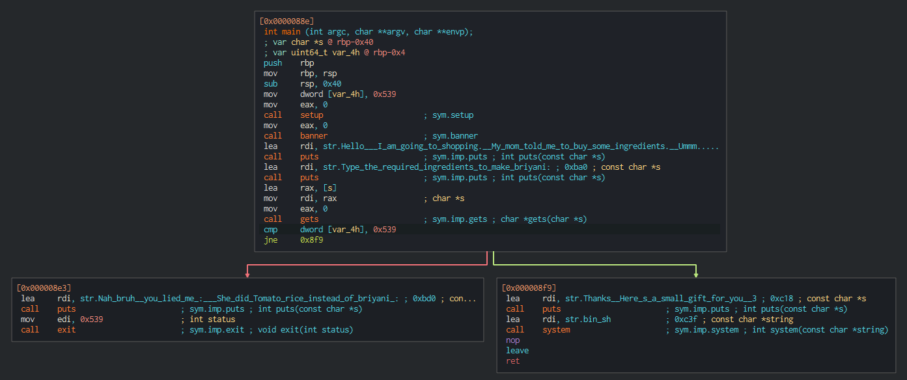

# Challenge 1 - pwn101

Check the binary with cutter.

There are two variables

 - *s - is a character pointer (starts at `rbp - 0x40`)
 - var_4h - is an unsigned int (starts at `rbp - 0x4`)

At the end of the main method there is a [gets()](https://man7.org/linux/man-pages/man3/gets.3.html) function call which reads from standard input (`mov eax, 0`) into the s variable (`lea rax, [s]` | `mov rdx, rax`)

_Note_:  
The [gets()](https://man7.org/linux/man-pages/man3/gets.3.html) method is vulnerable to buffer overflow, because it does not check the length of the input.

After the [gets()](https://man7.org/linux/man-pages/man3/gets.3.html) function the program checks the `var_4h` variable's value if it is equal to `0x539` which was set in the beginning of the main method.

- If equals, (red arrow) the program prints the message and exits.
- If not equals, (green arrow) the program starts a `/bin/sh` shell with the [system()](https://man7.org/linux/man-pages/man3/system.3.html) method.

_Conclusion_:  
We have to override the value of the `var_4h` variable.

Because the [gets()](https://man7.org/linux/man-pages/man3/gets.3.html) method reads from standard input without any validation, we can send as many input as we want.
The reading fills the memory up from bottom to top, so if we write `0x40` bytes to the `rbp - 0x40`, we will reach the `rbp`.
It means we completely override the `var_4h` from `rbp - 0x4`.

_Solution_:  
We need to write `0x40 - 0x4` bytes to reach the `var_4h` variable and 1 additional byte to change its value (a bit).
